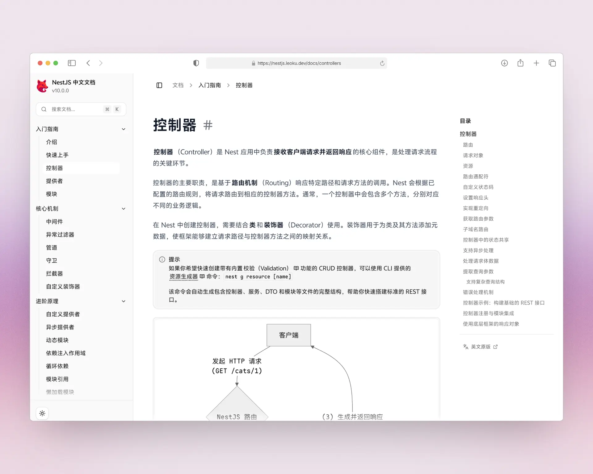

<p align="center">
  
</p>

<h1 align="center">NestJS 中文文档站</h1>

<p align="center">
  让中文开发者轻松掌握 NestJS 框架的最佳学习资源。不用翻墙、不看生涩英文，也能轻松学会 NestJS。
</p>

<p align="center">
  <a href="https://nestjs.leoku.dev"><b>阅读文档</b></a>　·
  <a href="https://github.com/Codennnn/NestJS-Docs-CN"><b>GitHub 仓库</b></a>　·
  <a href="https://github.com/Codennnn/NestJS-Docs-CN/issues"><b>问题反馈</b></a>
</p>



---

## 为什么选择本站

NestJS 官方文档内容扎实，但对中文开发者来说，仍然存在几个落地痛点：概念分散、例子偏抽象、术语翻译不统一、查阅时不好定位。本项目围绕这些问题做增量：

- **中文语境优先**：统一术语落法（如 Provider / Guard / Interceptor），示例注释中文化，避开生硬直译。
- **结构为查阅优化**：章节按「上手 → 核心机制 → 工程实践 → 架构进阶 → 上线」的真实使用路径组织。
- **图解抽象概念**：在模块关系、依赖注入作用域、请求生命周期等难点处补充 Mermaid 图。
- **全站中文搜索**：基于 Algolia / Orama，支持中文分词与模糊匹配。
- **现代阅读体验**：深色模式、Shiki 代码高亮、Twoslash 类型提示、一键复制。

## 学习路径

不确定从哪里开始？按你当下的场景选一条：

| 你的场景          | 建议阅读顺序                                |
| ----------------- | ------------------------------------------- |
| 第一次接触 NestJS | 介绍 → 快速上手 → 控制器 → 提供者 → 模块    |
| 想理解设计原理    | 模块 → 依赖注入作用域 → 动态模块 → 生命周期 |
| 在做真实业务      | 配置 → 验证 → 缓存 → 日志 → 任务调度 / 队列 |
| 在做架构设计      | 微服务 → GraphQL → WebSocket → Monorepo     |
| 准备上线          | 安全 → 性能 → 部署 → CI/CD                  |

完整目录见 [文档首页](https://nestjs.leoku.dev)。

## 核心功能

- **全文搜索**：中文分词，按章节 / API 名称精准命中
- **深色模式**：跟随系统或手动切换
- **代码体验**：Shiki 高亮 + Twoslash 类型提示 + 一键复制
- **图解辅助**：Mermaid 渲染流程图、时序图、关系图
- **持续同步**：跟进上游 NestJS 文档更新，标注版本差异

---

## 技术栈

- **框架与运行时**：Next.js 16 · React 19 · TypeScript · Node.js ≥ 22
- **内容与渲染**：MDX（`@next/mdx`）· Shiki + Twoslash · Mermaid · Tailwind CSS 4
- **搜索与分析**：Algolia · Orama · Vercel Analytics
- **工程化**：pnpm 9 · ESLint · Prettier · Stylelint

## 本地开发

> 环境要求：Node.js ≥ 22，推荐 pnpm 9。

```bash
git clone https://github.com/Codennnn/NestJS-Docs-CN.git
cd NestJS-Docs-CN

pnpm install                  # 安装依赖
pnpm dev                      # 启动开发服务器，默认 http://localhost:8080
pnpm build && pnpm start      # 生产构建与预览
pnpm lint                     # 代码检查（ts / es / css）
pnpm format:docs              # 统一 MDX 文档格式
```

## 参与贡献

这个项目欢迎内容型贡献，也欢迎面向体验和可维护性的改进。你可以参与：

- 翻译新增或缺失的 NestJS 文档章节
- 校对现有中文内容，统一术语并修正表达问题
- 同步上游 NestJS 文档更新，补充新特性、新示例与版本变更
- 修正文档中的代码示例、失效链接、排版问题和结构问题
- 优化文档站的阅读体验、导航结构和内容组织方式

建议流程：

1. Fork 仓库并创建功能分支
2. 在 `src/content/docs` 或相关代码目录中完成修改
3. 运行 `pnpm lint` 与 `pnpm format:docs`
4. 提交变更并发起 Pull Request，说明修改内容和原因

## License

本项目采用 MIT 开源协议。
