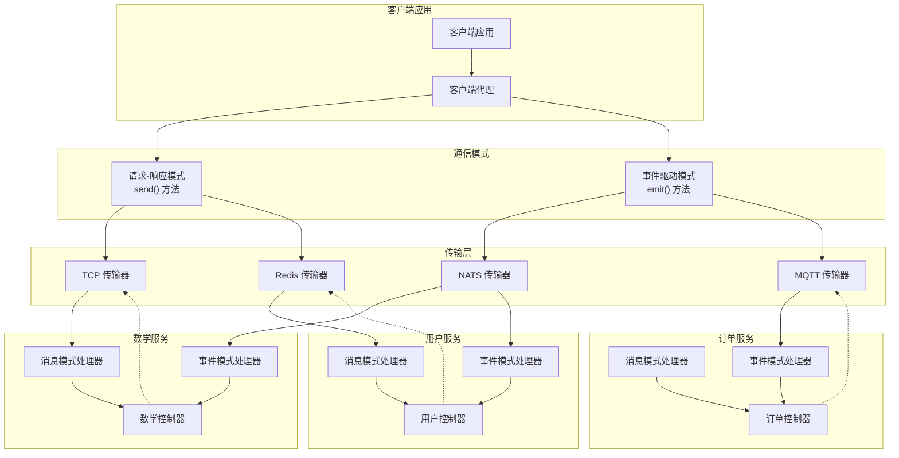

# 概述

除了传统的（有时称为单体架构）应用架构之外，Nest 还原生支持微服务架构风格的开发。文档其他部分讨论的大多数核心概念，如依赖注入、装饰器、异常过滤器、管道、守卫和拦截器等，同样适用于微服务。Nest 尽可能地对实现细节进行抽象，使得相同的组件能够在基于 HTTP 的平台、WebSocket 通信（WebSockets）以及微服务之间无缝运行。本节将介绍 Nest 针对微服务特性相关的内容。

在 Nest 中，微服务本质上是指使用不同于 HTTP 的**传输层**的应用程序。



Nest 提供了多种内置的传输层实现，称为**传输器**，它们负责在不同微服务实例之间传递消息。大多数传输器原生支持**请求-响应**和**基于事件的通信（Event-based communication）** 两种消息模式。Nest 将每种传输器的实现细节抽象在统一的接口之下，无论是请求-响应还是事件驱动消息，都能轻松切换传输层。例如，你可以根据实际需求选择特定传输层以获得更高的可靠性或性能，而无需修改应用代码。

## 安装

要开始构建微服务，首先需要安装相关依赖包：

```bash
npm install @nestjs/microservices
```

## 快速上手

要实例化一个微服务，请使用 `NestFactory` 类的 `createMicroservice()` 方法：

```ts filename='main.ts'
import { NestFactory } from '@nestjs/core'
import { Transport, MicroserviceOptions } from '@nestjs/microservices'
import { AppModule } from './app.module'

async function bootstrap() {
  const app = await NestFactory.createMicroservice<MicroserviceOptions>(
    AppModule,
    {
      transport: Transport.TCP,
    }
  )

  await app.listen()
}
```

<CalloutInfo>
  <div>微服务默认使用 **TCP** 传输层。</div>
</CalloutInfo>

`createMicroservice()` 方法的第二个参数是一个 `options` 对象。该对象可以包含两个成员：

| 属性        | 描述                                       |
| ----------- | ------------------------------------------ |
| `transport` | 指定传输器（如 `Transport.NATS`）          |
| `options`   | 特定于传输器的选项对象，用于决定传输器行为 |

`options` 对象是针对所选传输器定制的。**TCP** 传输器提供了如下属性。对于其他传输器（如 Redis、MQTT 等），请参阅相关章节以获取可用选项的说明。

| 属性            | 描述                                                                                                                                                     |
| --------------- | -------------------------------------------------------------------------------------------------------------------------------------------------------- |
| `host`          | 连接主机名                                                                                                                                               |
| `port`          | 连接端口                                                                                                                                                 |
| `retryAttempts` | 消息重试次数（默认值：`0`）                                                                                                                              |
| `retryDelay`    | 消息重试间隔（毫秒），默认值：`0`                                                                                                                        |
| `serializer`    | 用于出站消息的自定义[序列化器（serializer）](https://github.com/nestjs/nest/blob/master/packages/microservices/interfaces/serializer.interface.ts)       |
| `deserializer`  | 用于入站消息的自定义[反序列化器（deserializer）](https://github.com/nestjs/nest/blob/master/packages/microservices/interfaces/deserializer.interface.ts) |
| `socketClass`   | 继承自 `TcpSocket` 的自定义 Socket（默认值：`JsonSocket`）                                                                                               |
| `tlsOptions`    | 用于配置 TLS 协议的选项                                                                                                                                  |

<CalloutInfo>

上述属性仅适用于 TCP 传输器。关于其他传输器的可用选项，请参阅相关章节。

</CalloutInfo>

## 消息与事件模式

微服务通过模式（Pattern）来识别消息和事件。模式是一个普通的值，例如字面量对象或字符串。模式会被自动序列化，并与消息的数据部分一起通过网络发送。通过这种方式，消息发送方和消费者可以协调，确定哪些请求由哪些处理器消费。

## 请求-响应

当你需要在多个外部服务之间交换消息时，请求-响应消息风格非常有用。这种范式确保服务确实收到了消息（无需你手动实现确认协议）。然而，请求-响应方式并不总是最佳选择。例如，像 [Kafka](https://docs.confluent.io/3.0.0/streams/) 或 [NATS streaming](https://github.com/nats-io/node-nats-streaming) 这样的流式传输器（streaming transporter），它们采用基于日志的持久化机制，更适合应对另一类挑战，这类挑战更贴合事件消息（event messaging）范式（详见[基于事件的消息传递](/microservices/basics#基于事件)）。

为了启用请求-响应消息类型，Nest 会创建两个逻辑通道：一个用于传输数据，另一个用于等待响应的到来。对于某些底层传输层（如 [NATS](https://nats.io/)），这种双通道支持是开箱即用的。而对于其他传输层，Nest 则通过手动创建独立通道来实现。虽然这种方式有效，但也会带来一定的开销。因此，如果你不需要请求-响应消息风格，建议考虑使用事件驱动（event-based）方法。

要基于请求-响应范式创建消息处理器（message handler），请使用 `@MessagePattern()` 装饰器，该装饰器从 `@nestjs/microservices` 包中导入。此装饰器只能用于[控制器](/controllers)类中，因为控制器是应用程序的入口点。如果在提供者中使用该装饰器，将不会生效，因为 Nest 运行时会忽略它。

```ts filename='math.controller.ts'
import { Controller } from '@nestjs/common'
import { MessagePattern } from '@nestjs/microservices'

@Controller()
export class MathController {
  @MessagePattern({ cmd: 'sum' })
  accumulate(data: number[]): number {
    return (data || []).reduce((a, b) => a + b)
  }
}
```

在上述代码中，`accumulate()` **消息处理器**会监听与 `{{ '{' }} cmd: 'sum' {{ '}' }}` 消息模式匹配的消息。该消息处理器接收一个参数，即客户端传递的 `data`。在本例中，`data` 是一个需要累加的数字数组。

## 异步响应

消息处理器既可以同步响应，也可以**异步**响应，这意味着 `async` 方法是被支持的。

```ts
@MessagePattern({ cmd: 'sum' })
async accumulate(data: number[]): Promise<number> {
  return (data || []).reduce((a, b) => a + b)
}
```

消息处理器还可以返回一个 `Observable`，此时结果会在流（stream）结束前持续被发送。

```ts
@MessagePattern({ cmd: 'sum' })
accumulate(data: number[]): Observable<number> {
  return from([1, 2, 3])
}
```

在上面的示例中，消息处理器会**响应三次**，每次返回数组中的一个元素。

## 基于事件

虽然请求-响应方式非常适合服务之间的消息交换，但在事件驱动消息场景下 —— 也就是你只想发布**事件**而不需要等待响应时 —— 这种方式就不太合适了。此时，为请求-响应维护两条通道的开销是没有必要的。

例如，如果你想通知另一个服务系统中某个特定条件已经发生，事件驱动的消息风格就是理想选择。

要创建事件处理器，可以使用 `@EventPattern()` 装饰器，该装饰器从 `@nestjs/microservices` 包中导入。

```ts
@EventPattern('user_created')
async handleUserCreated(data: Record<string, unknown>) {
  // 业务逻辑
}
```

<CalloutInfo>

你可以为**同一个**事件模式注册多个事件处理器，所有处理器会自动并行触发。

</CalloutInfo>

`handleUserCreated()` **事件处理器**会监听 `'user_created'` 事件。事件处理器接收一个参数，即客户端传递的 `data`（在本例中，是通过网络发送的事件负载）。

## 获取更多请求详情

在更高级的场景中，你可能需要访问关于传入请求的更多详细信息。例如，当使用 NATS 并采用通配符订阅时，你可能希望获取生产者实际发送消息时使用的原始主题（subject）。类似地，在使用 Kafka 时，你可能需要访问消息头（headers）。要实现这些需求，你可以利用内置装饰器，如下所示：

```ts
import { NatsContext, Payload, Ctx } from '@nestjs/microservices'

@MessagePattern('time.us.*')
getDate(@Payload() data: number[], @Ctx() context: NatsContext) {
  console.log(`Subject: ${context.getSubject()}`) // 例如 "time.us.east"
  return new Date().toLocaleTimeString(...)
}
```

f

<CalloutInfo>
  你还可以为 `@Payload()` 装饰器传入属性键，以便从传入的 payload
  对象中提取特定属性，例如：`@Payload('id')`。
</CalloutInfo>

## 客户端（生产者类）

Nest 客户端应用可以使用 `ClientProxy` 类与 Nest 微服务进行消息交换或事件发布。该类提供了多种方法，例如 `send()`（用于请求-响应消息模式）和 `emit()`（用于事件驱动消息模式），从而实现与远程微服务的通信。你可以通过以下方式获取该类的实例：

一种方式是导入 `ClientsModule`，该模块暴露了静态的 `register()` 方法。此方法接收一个对象数组，每个对象代表一个微服务传输器。每个对象必须包含 `name` 属性，并且可以选择性地包含 `transport` 属性（默认为 `Transport.TCP`），以及可选的 `options` 属性。

`name` 属性作为**注入令牌**（Injection Token），你可以在需要的地方通过该令牌注入 `ClientProxy` 实例。`name` 的值可以是任意字符串或 JavaScript 符号，具体说明见[此处](/fundamentals/custom-providers#非服务类提供者)。

`options` 属性是一个对象，包含了我们在前文 `createMicroservice()` 方法中见过的相同属性。

```ts
@Module({
  imports: [
    ClientsModule.register([
      { name: 'MATH_SERVICE', transport: Transport.TCP },
    ]),
  ],
})
```

如果你需要在设置过程中提供配置或执行其他异步操作，也可以使用 `registerAsync()` 方法。

```ts
import { ClientsModule } from '@nestjs/microservices'

@Module({
  imports: [
    ClientsModule.registerAsync([
      {
        imports: [ConfigModule],
        name: 'MATH_SERVICE',
        useFactory: async (configService: ConfigService) => ({
          transport: Transport.TCP,
          options: {
            url: configService.get('URL'),
          },
        }),
        inject: [ConfigService],
      },
    ]),
  ],
})
```

模块导入后，你可以使用 `@Inject()` 装饰器，基于指定的 `'MATH_SERVICE'` 传输器配置，注入 `ClientProxy` 实例。

```ts
import { ClientProxy } from '@nestjs/microservices'

constructor(
  @Inject('MATH_SERVICE') private client: ClientProxy,
) {}
```

有时，你可能需要从其他服务（如 `ConfigService`）获取传输器配置，而不是在客户端应用中硬编码。此时可以使用 `ClientProxyFactory` 类注册[自定义提供者](/fundamentals/custom-providers)。该类提供静态的 `create()` 方法，接收传输器选项对象并返回自定义的 `ClientProxy` 实例。

```ts
import { ClientProxyFactory } from '@nestjs/microservices'

@Module({
  providers: [
    {
      provide: 'MATH_SERVICE',
      useFactory: (configService: ConfigService) => {
        const mathSvcOptions = configService.getMathSvcOptions()
        return ClientProxyFactory.create(mathSvcOptions)
      },
      inject: [ConfigService],
    }
  ]
  ...
})
```

另一种方式是使用 `@Client()` 属性装饰器。

```ts
import { Client, Transport } from '@nestjs/microservices'

@Client({ transport: Transport.TCP })
client: ClientProxy
```

不推荐使用 `@Client()` 装饰器，因为这样更难进行测试，也不便于共享客户端实例。

`ClientProxy` 是**懒加载**的。它不会立即建立连接，而是在首次调用微服务时才建立连接，并在后续调用中复用该连接。不过，如果你希望在连接建立后再启动应用，可以在 `OnApplicationBootstrap` 生命周期钩子中，手动调用 `ClientProxy` 对象的 `connect()` 方法来主动建立连接。

```ts
async onApplicationBootstrap() {
  await this.client.connect()
}
```

如果连接无法建立，`connect()` 方法会抛出相应的错误对象。

## 发送消息

`ClientProxy` 提供了 `send()` 方法。该方法用于调用微服务，并返回一个包含响应的**冷 Observable**。因此，我们可以很方便地对其发出的值进行订阅。

```ts
accumulate(): Observable<number> {
  const pattern = { cmd: 'sum' }
  const payload = [1, 2, 3]
  return this.client.send<number>(pattern, payload)
}
```

`send()` 方法接收两个参数：`pattern` 和 `payload`。其中，`pattern` 需要与 `@MessagePattern()` 装饰器中定义的模式相匹配，`payload` 则是我们希望传递给远程微服务的数据。该方法返回一个**冷 Observable**，也就是说，只有在你显式订阅它之后，消息才会被真正发送。

## 事件发布

如需发送事件，可以使用 `ClientProxy` 对象的 `emit()` 方法。该方法会将事件发布到消息代理（message broker）。

```ts
async publish() {
  this.client.emit<number>('user_created', new UserCreatedEvent())
}
```

`emit()` 方法同样接收两个参数：`pattern` 和 `payload`。其中，`pattern` 需要与 `@EventPattern()` 装饰器中定义的模式相匹配，`payload` 则表示你希望传递给远程微服务的事件数据。该方法返回一个**热 Observable**（与 `send()` 返回的冷 Observable 相对），也就是说，无论你是否显式订阅该 Observable，代理都会立即尝试投递事件。

## 请求作用域

对于来自不同编程语言背景的开发者来说，可能会惊讶地发现，在 Nest 中，大多数内容在所有传入请求之间是共享的。这包括数据库的连接池、具有全局状态的单例服务等。需要注意的是，Node.js 并不采用每个请求由独立线程处理的请求/响应多线程无状态模型。因此，在我们的应用程序中使用单例实例是**安全**的。

然而，在某些边缘场景下，可能希望处理器具有基于请求的生命周期。例如，在 GraphQL 应用中进行每个请求的缓存、请求追踪或多租户等场景。你可以在[这里](/fundamentals/injection-scopes)了解如何控制作用域。

请求作用域的处理器和提供者可以通过 `@Inject()` 装饰器结合 `CONTEXT` 注入令牌，注入 `RequestContext`：

```ts
import { Injectable, Scope, Inject } from '@nestjs/common'
import { CONTEXT, RequestContext } from '@nestjs/microservices'

@Injectable({ scope: Scope.REQUEST })
export class CatsService {
  constructor(@Inject(CONTEXT) private ctx: RequestContext) {}
}
```

这样可以访问 `RequestContext` 对象，该对象包含两个属性：

```ts
export interface RequestContext<T = any> {
  pattern: string | Record<string, any>
  data: T
}
```

`data` 属性是消息生产者发送的消息载荷（payload）。`pattern` 属性用于标识用于处理传入消息的合适处理器的消息模式（pattern）。

## 实例状态更新

如果你希望实时获取连接和底层驱动实例的状态更新，可以订阅 `status` 流。该流会提供特定于所选驱动的状态更新。例如，如果你使用的是 TCP 传输器（默认选项），`status` 流会发出 `connected` 和 `disconnected` 事件。

```ts
import { TcpStatus } from '@nestjs/microservices'

this.client.status.subscribe((status: TcpStatus) => {
  console.log(status)
})
```

同样，你也可以订阅服务器的 `status` 流，以接收关于服务器状态的通知。

```ts
const server = app.connectMicroservice<MicroserviceOptions>(...)
server.status.subscribe((status: TcpStatus) => {
  console.log(status)
})
```

## 监听内部事件

在某些情况下，你可能希望监听微服务内部触发的事件。例如，你可以监听 `error` 事件，在发生错误时执行额外的操作。要实现这一点，可以使用 `on()` 方法，如下所示：

```ts
this.client.on('error', (err) => {
  console.error(err)
})
```

同样，你也可以监听服务端的内部事件：

```ts
import { TcpEvents } from '@nestjs/microservices'

server.on<TcpEvents>('error', (err) => {
  console.error(err)
})
```

## 访问底层驱动实例

对于更高级的用例，你可能需要访问底层驱动实例（driver instance）。这在需要手动关闭连接或调用驱动特有方法等场景下非常有用。但请注意，在大多数情况下，你**不需要**直接操作驱动。

要访问底层驱动实例，可以使用 `unwrap()` 方法。该方法会返回底层驱动实例。泛型类型参数应指定你期望的驱动实例类型。

```ts
const netServer = this.client.unwrap<Server>()
```

这里的 `Server` 类型是从 `net` 模块导入的。

同样，你也可以访问服务端的底层驱动实例：

```ts
const netServer = server.unwrap<Server>()
```

## 处理超时

在分布式系统中，微服务有时可能会宕机或不可用。为了避免无限期等待，可以使用超时机制（timeout）。在与其他服务通信时，超时是一种非常实用的模式。要为微服务调用应用超时，可以使用 [RxJS](https://rxjs.dev) 的 `timeout` 操作符（operator）。如果微服务在指定时间内没有响应，将会抛出异常，你可以捕获并妥善处理。

要实现这一点，需要使用 [`rxjs`](https://github.com/ReactiveX/rxjs) 包。在管道中直接使用 `timeout` 操作符即可：

```ts
this.client.send<TResult, TInput>(pattern, data).pipe(timeout(5000))
```

<CalloutInfo>
  <div>`timeout` 操作符从 `rxjs/operators` 包中导入。</div>
</CalloutInfo>

如果在 5 秒内微服务没有响应，将会抛出错误。

## TLS 支持

当服务需要在私有网络之外进行通信时，确保通信加密对于安全性至关重要。在 NestJS 中，可以通过 Node 内置的 [TLS](https://nodejs.org/api/tls.html) 模块，在 TCP 之上实现 TLS 加密。Nest 在其 TCP 传输层内置了对 TLS 的支持，使我们能够加密微服务或客户端之间的通信。

要为 TCP 服务器启用 TLS，需要准备 PEM 格式的私钥和证书。只需在服务器的配置选项中设置 `tlsOptions`，并指定 key 和 cert 文件，如下所示：

```ts
import * as fs from 'node:fs'
import { NestFactory } from '@nestjs/core'
import { AppModule } from './app.module'
import { MicroserviceOptions, Transport } from '@nestjs/microservices'

async function bootstrap() {
  const key = fs.readFileSync('<pathToKeyFile>', 'utf8').toString()
  const cert = fs.readFileSync('<pathToCertFile>', 'utf8').toString()

  const app = await NestFactory.createMicroservice<MicroserviceOptions>(
    AppModule,
    {
      transport: Transport.TCP,
      options: {
        tlsOptions: {
          key,
          cert,
        },
      },
    }
  )

  await app.listen()
}
```

客户端若要通过 TLS 安全通信，同样需要定义 `tlsOptions`，但此时应提供 CA 证书（即签署服务器证书的权威机构证书）。这样可以确保客户端信任服务器证书，从而建立安全连接。

```ts
import { Module } from '@nestjs/common'
import { ClientsModule, Transport } from '@nestjs/microservices'

@Module({
  imports: [
    ClientsModule.register([
      {
        name: 'MATH_SERVICE',
        transport: Transport.TCP,
        options: {
          tlsOptions: {
            ca: [fs.readFileSync('<pathToCaFile>', 'utf-8').toString()],
          },
        },
      },
    ]),
  ],
})
export class AppModule {}
```

如果你的环境涉及多个受信任的机构，也可以传递 CA 证书数组。

配置完成后，可以像往常一样通过 `@Inject()` 装饰器注入 `ClientProxy`，在服务中使用客户端。这样即可确保 NestJS 微服务之间的通信经过加密，底层加密细节由 Node 的 `TLS` 模块处理。

更多信息请参考 Node 的 [TLS 文档](https://nodejs.org/api/tls.html)。

## 动态配置

当微服务需要通过 `ConfigService`（配置服务，ConfigService）进行配置，但注入上下文仅在微服务实例创建后才可用时，可以使用 `AsyncMicroserviceOptions`（异步微服务选项，AsyncMicroserviceOptions）来实现动态配置，从而顺利集成 `ConfigService`。

```ts
import { ConfigService } from '@nestjs/config'
import { AsyncMicroserviceOptions, Transport } from '@nestjs/microservices'
import { AppModule } from './app.module'

async function bootstrap() {
  const app = await NestFactory.createMicroservice<AsyncMicroserviceOptions>(
    AppModule,
    {
      useFactory: (configService: ConfigService) => ({
        transport: Transport.TCP,
        options: {
          host: configService.get<string>('HOST'),
          port: configService.get<number>('PORT'),
        },
      }),
      inject: [ConfigService],
    }
  )

  await app.listen()
}
```
